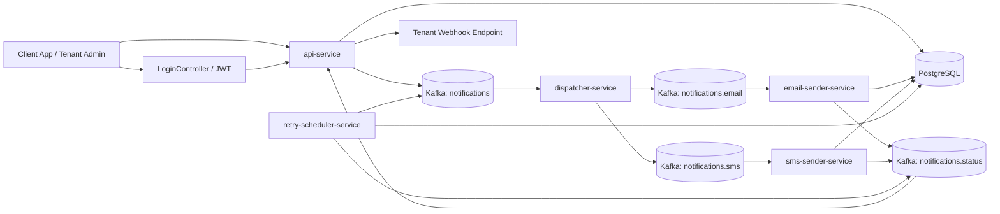

# NotiX

NotiX is an event-driven notification platform built with Spring Boot, Kafka, and PostgreSQL. The project started as a delivery-engine proof of concept and is now evolving into a SaaS-ready notification platform with tenant-aware APIs, local JWT login, tenant memberships, API keys, provider configuration, templates, scheduling, usage metering, and webhook delivery.

The repo currently carries both:

- the original v1 POC APIs for simple notification intake and status lookup
- a newer v2 SaaS foundation under `/v2` that introduces control-plane and tenant-scoped behavior

## Documentation

- [High-Level Design](docs/HLD.md)
- [Low-Level Design](docs/LLD.md)
- [Database Design](docs/Database-Design.md)
- [Grafana Dashboard JSON](docs/NotiX_Grafana_Dashboard.json)
- [Legacy Diagram Source](docs/digram.xml)
- [Legacy SQL Reference](docs/hld-v2.0.sql)

## Module Docs

- [api-service](api-service/README.md)
- [dispatcher-service](dispatcher-service/README.md)
- [email-sender-service](email-sender-service/README.md)
- [sms-sender-service](sms-sender-service/README.md)
- [retry-scheduler-service](retry-scheduler-service/README.md)
- [common](common/README.md)

## Architecture Overview



## What NotiX Is Achieving

- decoupled notification intake from channel delivery through Kafka
- channel-specific workers for email and SMS
- canonical notification records plus attempt-level delivery logs
- retry and dead-letter handling for failed deliveries
- tenant-aware v2 APIs for SaaS-style control-plane operations
- local JWT login plus API-key and header-based tenant authentication
- usage metering and outbound webhook notifications
- room to grow without discarding the v1 POC path

## Architectural Direction

NotiX v2 is intentionally split into two logical layers:

- `data plane`
  - intake, dispatch, delivery, retries, status events, scheduling, webhook dispatch
- `control plane`
  - tenants, platform users, memberships, API keys, providers, templates, usage, audit

This lets the existing delivery engine keep working while the repo grows toward a multi-tenant product.

## Modules

| Module | Responsibility | Default Port |
| --- | --- | --- |
| `api-service` | Public HTTP entrypoint, auth, v2 control plane, notification orchestration, schedule dispatch, status ingestion, webhook dispatch | `7070` |
| `dispatcher-service` | Routes the main notification topic to channel-specific topics | `7071` |
| `email-sender-service` | Consumes email events, resolves provider config, records attempts, emits status events | `7072` |
| `sms-sender-service` | Consumes SMS events, uses Twilio/provider config, records attempts, emits status events | `7073` |
| `retry-scheduler-service` | Retries failed attempts, writes dead letters, emits terminal status events | `7074` |
| `common` | Shared DTOs and enums used across the services | n/a |

## Public API Surface

### v1 APIs

- `POST /notifications/send`
- `GET /notifications/status/{id}`

### Login

- `POST /auth/login`
- `POST /v2/auth/login`

### v2 APIs

- `POST /v2/tenants`
- `POST /v2/tenant-memberships`
- `POST /v2/api-keys`
- `POST /v2/providers`
- `POST /v2/templates`
- `POST /v2/webhooks`
- `POST /v2/notifications`
- `GET /v2/notifications/{id}`
- `GET /v2/notifications/{id}/attempts`
- `POST /v2/schedules`
- `GET /v2/usage`

## Kafka Topics

| Topic | Produced By | Consumed By | Purpose |
| --- | --- | --- | --- |
| `notifications` | `api-service`, `retry-scheduler-service` | `dispatcher-service` | Main ingress for new and retried notifications |
| `notifications.email` | `dispatcher-service` | `email-sender-service` | Email delivery work |
| `notifications.sms` | `dispatcher-service` | `sms-sender-service` | SMS delivery work |
| `notifications.status` | `email-sender-service`, `sms-sender-service`, `retry-scheduler-service` | `api-service` | Delivery outcome events for usage and webhooks |

## Authentication Model

### v1

- `X-API-KEY` for `/notifications/*`

### v2

- `X-NOTIX-BOOTSTRAP-KEY` for tenant bootstrap
- `X-NOTIX-API-KEY` for machine-to-machine tenant access
- `Authorization: Bearer <jwt>` for local application login
- `X-NOTIX-EXTERNAL-USER-ID` plus `X-NOTIX-TENANT-ID` for external-IdP style integration

## Default Local Credentials

These defaults are intended only for local development and should be changed before any shared or public environment.

| Credential | Default Value |
| --- | --- |
| v1 API key | `notix-secret-key` |
| v2 bootstrap key | `notix-bootstrap-admin-key` |
| admin username | `admin` |
| admin password | `admin123` |
| operator username | `operator` |
| operator password | `operator123` |

## Example Login

```json
{
  "login": "admin",
  "password": "admin123"
}
```

## Example v2 Notification Request

```json
{
  "channel": "EMAIL",
  "to": "user@example.com",
  "templateId": "11111111-1111-1111-1111-111111111111",
  "params": {
    "name": "Abhishek"
  },
  "idempotencyKey": "signup-welcome-001"
}
```

## Data Model Summary

The current schema uses one shared PostgreSQL database for local development. The key concepts are:

- `notifications`
  - canonical notification intent and lifecycle state
- `delivery_logs`
  - immutable delivery attempts
- `dead_letters`
  - terminal failures copied out for operations
- `tenants`, `platform_users`, `tenant_memberships`
  - tenant and identity model
- `api_keys`, `provider_accounts`, `notification_templates`
  - control-plane configuration
- `notification_schedules`, `usage_events`, `webhook_endpoints`, `webhook_deliveries`, `audit_logs`
  - product and operational support tables

Read the full table and relationship breakdown in [Database Design](docs/Database-Design.md).

## Build And Run

Build the full reactor from the repo root:

```bash
./api-service/mvnw -f pom.xml package -DskipTests
```

Start the local infrastructure:

```bash
docker compose -f infrastructure/docker/docker-compose.yml up -d
```

Run each service:

```bash
./api-service/mvnw -f api-service/pom.xml spring-boot:run
./dispatcher-service/mvnw -f dispatcher-service/pom.xml spring-boot:run
./email-sender-service/mvnw -f email-sender-service/pom.xml spring-boot:run
./sms-sender-service/mvnw -f sms-sender-service/pom.xml spring-boot:run
./retry-scheduler-service/mvnw -f retry-scheduler-service/pom.xml spring-boot:run
```

## Local Infrastructure Defaults

- Kafka: `localhost:9092`
- PostgreSQL: `localhost:5433`
- Prometheus: `http://localhost:9090`
- Grafana: `http://localhost:3000`
- Swagger UI: `http://localhost:7070/swagger-ui.html`

## Current State

The repo is intentionally in a mixed state:

- v1 remains available so the original POC flow still works
- v2 adds the SaaS-ready identity, tenancy, scheduling, webhook, and metering foundation
- tenant IDs and control-plane tables exist today
- full PostgreSQL row-level security is still a future hardening step rather than an enforced database policy in the current codebase

That makes this repository a practical bridge from learning-oriented microservice POC to a more product-ready notification backend.
