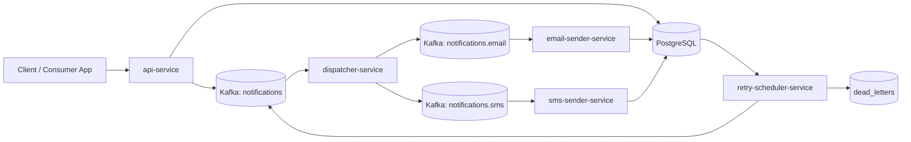

# NotiX

NotiX is a notification delivery platform POC built to demonstrate how a microservice-based system can accept notification requests, route them asynchronously, deliver across multiple channels, track delivery state, retry failures, and expose operational visibility.

The current implementation focuses on two channels:

- Email
- SMS

This project is less about building a polished end-user product today and more about proving the backend architecture needed for a scalable notification platform:

- asynchronous processing with Kafka
- clear service boundaries
- delivery tracking and retry orchestration
- operational observability
- basic API protection
- an extensible foundation for future SaaS evolution

## What NotiX Is Achieving

NotiX models the core workflow behind real-world notification systems:

1. accept a request from a client
2. persist the notification intent
3. publish an event to a message broker
4. route by channel
5. deliver through a channel worker
6. record delivery attempts
7. retry failed attempts
8. preserve terminal failures in a dead-letter store

That makes this repo a strong POC for learning and demonstrating:

- event-driven microservices
- delivery-state management
- retry and DLQ handling
- service-to-service decoupling
- observability with Prometheus and Grafana
- API key auth and rate limiting

## Design Docs

- [High-Level Design](docs/HLD.md)
- [Low-Level Design](docs/LLD.md)
- [Grafana Dashboard JSON](docs/NotiX_Grafana_Dashboard.json)
- [Architecture Diagram Source](docs/digram.xml)

## Service Docs

- [api-service](api-service/README.md)
- [dispatcher-service](dispatcher-service/README.md)
- [email-sender-service](email-sender-service/README.md)
- [sms-sender-service](sms-sender-service/README.md)
- [retry-scheduler-service](retry-scheduler-service/README.md)

## Current Architecture



## Core Services

| Module | Responsibility | Default Port |
| --- | --- | --- |
| `api-service` | Accepts notification requests, validates input, stores notification metadata, publishes to Kafka, exposes status API | `7070` |
| `dispatcher-service` | Consumes the main topic and routes events to channel-specific topics | `7071` |
| `email-sender-service` | Consumes email events and records email delivery attempts | `7072` |
| `sms-sender-service` | Consumes SMS events, invokes Twilio, and records SMS delivery attempts | `7073` |
| `retry-scheduler-service` | Finds retryable failures, republishes attempts, and persists dead-letter entries | `7074` |
| `common` | Shared DTOs and enums used across services | n/a |

## Technology Stack

- Java 25
- Spring Boot 3.5.13
- Apache Kafka
- PostgreSQL
- Spring Data JPA
- Spring Actuator
- SpringDoc / Swagger UI
- Bucket4j
- Twilio SDK
- Prometheus
- Grafana

## Repository Layout

```text
.
├── api-service
├── common
├── dispatcher-service
├── docs
├── email-sender-service
├── infrastructure
├── retry-scheduler-service
├── sms-sender-service
└── pom.xml
```

The root `pom.xml` is a Maven reactor build, so the full project can now be built from the repo root.

## Message Flow

### Public Request

Clients send a channel-neutral request to the API:

```json
{
  "to": "recipient@example.com",
  "channel": "EMAIL",
  "template": "WELCOME_TEMPLATE",
  "params": {
    "username": "Abhishek"
  }
}
```

### Internal Event

The API transforms that request into an internal Kafka event with:

- generated `id`
- `channel`
- `template`
- `params`
- `attemptNo`

`attemptNo` starts at `1` and increments when the retry scheduler republishes failed notifications.

## Kafka Topics

| Topic | Purpose |
| --- | --- |
| `notifications` | Main ingress topic published by `api-service` |
| `notifications.email` | Channel-specific topic for email delivery |
| `notifications.sms` | Channel-specific topic for SMS delivery |

## Persistence Model

The current POC uses one logical PostgreSQL database in local development.

### `notifications`

Stores the canonical notification record:

- `id`
- `recipient`
- `channel`
- `template`
- `status`
- `created_at`
- `updated_at`

### `delivery_logs`

Stores per-attempt execution history:

- `notification_id`
- `attempt_no`
- `status`
- `error_message`
- `timestamp`

### `dead_letters`

Stores terminal failures:

- `id`
- `recipient`
- `channel`
- `template`
- `status`
- `error_message`
- `created_at`

## API Surface

### Main API

- `POST /notifications/send`
- `GET /notifications/status/{id}`

### Retry / DLQ Operations

- `POST /retry/trigger`
- `GET /retry/dead-letters`
- `GET /dlq`
- `GET /dlq/channel/{channel}`
- `GET /dlq/template/{template}`
- `GET /dlq/search`

### Test / Demo Endpoints

The repo also contains test-oriented endpoints such as:

- `POST /test/api/send`
- `GET /test/api/rate-limiter`
- `POST /test/email/send`
- `POST /test/sms/send`
- `POST /test/retry/trigger`

These are useful for exploration and demos, but they are not the main product API contract.

## Security

The POC includes basic API protection in `api-service`:

- API key filter using `X-API-KEY`
- in-memory rate limiting using Bucket4j

Default local API key:

```text
notix-secret-key
```

Current rate limit:

- 10 requests per minute per API key on `/notifications/*`

## Observability

Each service exposes actuator metrics and Prometheus-friendly endpoints.

Local observability stack:

- Prometheus: `http://localhost:9090`
- Grafana: `http://localhost:3000`
- Swagger UI: `http://localhost:7070/swagger-ui.html`

Prometheus and Grafana are included in the Docker setup under `infrastructure/docker`.

## Local Development

### Prerequisites

- JDK 25
- Docker / Docker Compose
- Maven 3.9+ or use the existing module wrappers

### 1. Start Infrastructure

```bash
docker compose -f infrastructure/docker/docker-compose.yml up -d
```

This starts:

- Zookeeper
- Kafka
- PostgreSQL
- Prometheus
- Grafana

### 2. Build the Whole Repo

```bash
mvn -f pom.xml package -DskipTests
```

### 3. Run Each Service

```bash
./api-service/mvnw -f api-service/pom.xml spring-boot:run
./dispatcher-service/mvnw -f dispatcher-service/pom.xml spring-boot:run
./email-sender-service/mvnw -f email-sender-service/pom.xml spring-boot:run
./sms-sender-service/mvnw -f sms-sender-service/pom.xml spring-boot:run
./retry-scheduler-service/mvnw -f retry-scheduler-service/pom.xml spring-boot:run
```

## Local Runtime Defaults

### Infrastructure

- Kafka: `localhost:9092`
- PostgreSQL: `localhost:5433`
- Database: `notix`
- DB user: `notix_user`
- DB password: `notix_pass`

### Services

- `api-service`: `7070`
- `dispatcher-service`: `7071`
- `email-sender-service`: `7072`
- `sms-sender-service`: `7073`
- `retry-scheduler-service`: `7074`

## Example Usage

### Send a Notification

```bash
curl --request POST 'http://localhost:7070/notifications/send' \
  --header 'Content-Type: application/json' \
  --header 'X-API-KEY: notix-secret-key' \
  --data '{
    "to": "recipient@example.com",
    "channel": "EMAIL",
    "template": "WELCOME_TEMPLATE",
    "params": {
      "username": "Abhishek"
    }
  }'
```

### Check Delivery Status

```bash
curl --request GET 'http://localhost:7070/notifications/status/<notification-id>' \
  --header 'X-API-KEY: notix-secret-key'
```

Typical response shape:

```json
{
  "id": "a7c7c9b8-6e2d-4a1d-8c25-b2d9d7b58f09",
  "status": "SENT",
  "attempts": [
    {
      "attemptNo": 1,
      "status": "SENT",
      "timestamp": "2026-04-03T15:04:21.123Z"
    }
  ]
}
```

## Build and Dependency Model

The repo now supports both workflows:

### Build everything together

```bash
mvn -f pom.xml package -DskipTests
```

### Use `common` from another local project

```bash
./common/mvnw -f common/pom.xml install -DskipTests
```

Then add this dependency in the other project:

```xml
<dependency>
    <groupId>com.abhishek.notix</groupId>
    <artifactId>common</artifactId>
    <version>0.0.1-SNAPSHOT</version>
</dependency>
```

## Current POC Characteristics

What this POC does well:

- demonstrates asynchronous notification orchestration
- separates API, routing, channel delivery, and retry concerns
- keeps delivery history per attempt
- exposes monitoring endpoints
- provides a clean foundation for future extensions

What is intentionally still POC-level:

- email sending is currently mocked rather than fully SMTP-driven
- local development uses a single PostgreSQL instance
- tests are minimal and mostly scaffolded
- auth is API-key based rather than OAuth2 or JWT
- tenancy, quotas, billing, and advanced workflows are future work

## Roadmap Direction

The current repo is a strong base for future upgrades such as:

- tenant isolation
- template management
- quota and billing controls
- provider failover
- richer retry policies and exponential backoff
- audit and analytics APIs
- dashboard and tenant-facing UI

## Author

Built by Abhishek Gupta as a notification-system microservices learning and architecture project.
