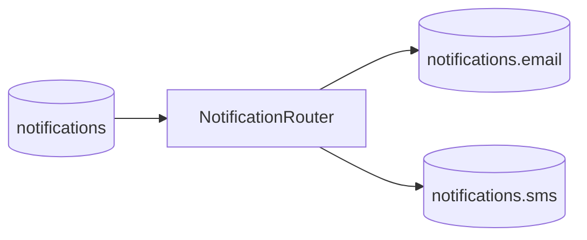

# dispatcher-service

`dispatcher-service` is the routing hub of the data plane. It keeps channel-routing logic separate from both the public API and the delivery workers.

## Responsibilities

- consume `NotificationEvent` from `notifications`
- inspect the `channel` field
- forward events to `notifications.email` or `notifications.sms`
- preserve the notification ID as the Kafka message key for downstream ordering and traceability

## Topic Flow



## Inputs

- Kafka topic: `notifications`
- manual test endpoint: `POST /notifications/send`

## Outputs

- Kafka topic: `notifications.email`
- Kafka topic: `notifications.sms`

## Important Classes

- `NotificationRouter`
- `KafkaConfig`
- `NotificationController`

## Notes

- this service does not own product state
- it is intentionally thin so routing remains easy to extend when new channels are added
- it registers with Eureka at `http://localhost:7070/eureka/`

## Local Defaults

- Port: `7071`
- Kafka: `localhost:9092`
- Swagger UI: `http://localhost:7071/swagger-ui.html`
- Eureka client: `http://localhost:7070/eureka/`

## Run

```bash
./mvnw -f pom.xml spring-boot:run
```

Run from inside `dispatcher-service/`.

## Read Next

- [Root README](../README.md)
- [Low-Level Design](../docs/LLD.md)
