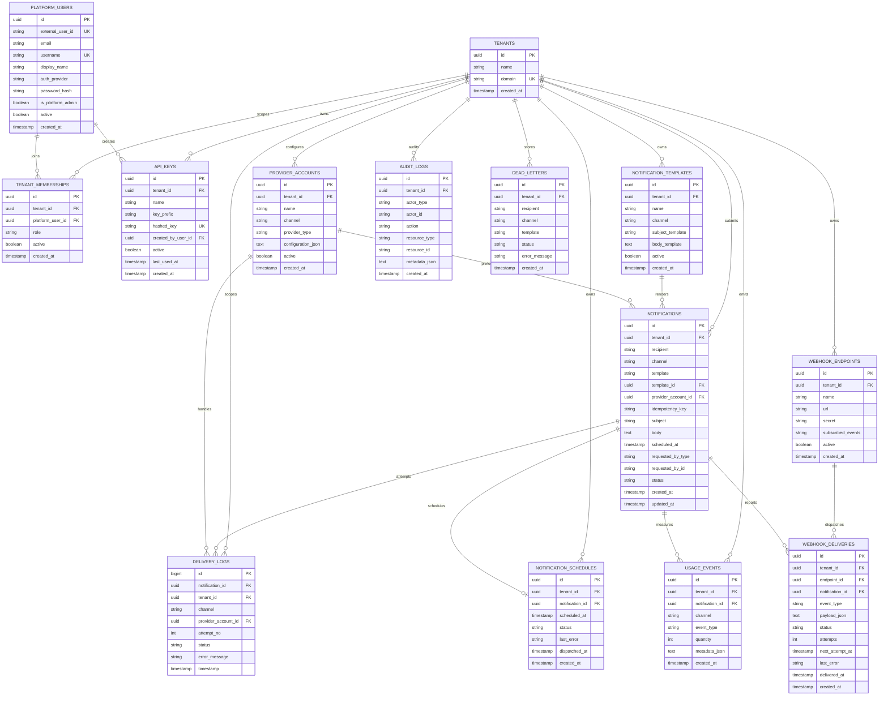

# NotiX Database Design

## 1. Purpose

This document explains the current NotiX database model, the intent behind the main tables, and the relationships that support the v2 SaaS-ready architecture. The schema is currently stored in one shared PostgreSQL database for local development, but the model is already organized around tenant-aware boundaries.

## 2. Design Principles

- keep notification intent separate from delivery attempts
- make `tenant_id` the core scoping mechanism for SaaS data
- let control-plane tables live alongside data-plane tables
- keep JPA entities local to each service even when table names overlap
- treat usage, webhook, and audit data as operational records, not as delivery-state substitutes

## 3. ERD

The diagram below shows the logical relationships used by the current implementation. Several of these are application-level UUID relationships rather than explicit JPA associations.

## 4. Table Groups

### 4.1 Tenant And Identity

| Table | Purpose | Important Columns |
| --- | --- | --- |
| `tenants` | Root tenant record | `id`, `name`, `domain` |
| `platform_users` | Human or external identities | `external_user_id`, `email`, `username`, `auth_provider`, `password_hash`, `is_platform_admin` |
| `tenant_memberships` | Tenant-scoped role assignment | `tenant_id`, `platform_user_id`, `role`, `active` |
| `api_keys` | Machine access for tenant APIs | `tenant_id`, `hashed_key`, `created_by_user_id`, `last_used_at` |

### 4.2 Notification Configuration

| Table | Purpose | Important Columns |
| --- | --- | --- |
| `provider_accounts` | Tenant-owned email/SMS provider configuration | `tenant_id`, `channel`, `provider_type`, `configuration_json`, `active` |
| `notification_templates` | Reusable tenant message templates | `tenant_id`, `channel`, `subject_template`, `body_template`, `active` |
| `webhook_endpoints` | Tenant-owned outbound callback configuration | `tenant_id`, `url`, `secret`, `subscribed_events`, `active` |

### 4.3 Notification Execution

| Table | Purpose | Important Columns |
| --- | --- | --- |
| `notifications` | Canonical business record for a notification | `tenant_id`, `recipient`, `channel`, `template`, `template_id`, `provider_account_id`, `idempotency_key`, `subject`, `body`, `scheduled_at`, `status` |
| `delivery_logs` | Attempt-level runtime history | `notification_id`, `tenant_id`, `provider_account_id`, `attempt_no`, `status`, `error_message`, `timestamp` |
| `notification_schedules` | One-time future dispatch state | `tenant_id`, `notification_id`, `scheduled_at`, `status`, `dispatched_at` |
| `dead_letters` | Terminal failure snapshot | `tenant_id`, `recipient`, `channel`, `template`, `status`, `error_message` |

### 4.4 Metering And Governance

| Table | Purpose | Important Columns |
| --- | --- | --- |
| `usage_events` | Immutable event-based usage trail | `tenant_id`, `notification_id`, `event_type`, `quantity`, `metadata_json` |
| `webhook_deliveries` | Retryable outbound webhook dispatches | `tenant_id`, `endpoint_id`, `notification_id`, `event_type`, `status`, `attempts`, `next_attempt_at`, `delivered_at` |
| `audit_logs` | Operational and control-plane audit trail | `tenant_id`, `actor_type`, `actor_id`, `action`, `resource_type`, `resource_id`, `metadata_json` |

## 5. Relationship Notes

### Notifications vs Delivery Logs

This is the most important modeling decision in the repo.

- `notifications` answers: what notification exists, for whom, for what tenant, and what is its current state
- `delivery_logs` answers: how many times did we try, through which provider, and what happened each time

That split keeps retries, status APIs, webhook emission, and future billing logic clean.

### Memberships vs Roles

Roles are not global. They are attached through `tenant_memberships`, which means a user can be:

- admin in one tenant
- member in another tenant
- platform admin across the whole system

### Dead Letters Are Snapshot Records

`dead_letters` currently stores a copy of terminal failure data rather than a direct `notification_id` foreign key. This is acceptable for the current operational design, but it is worth revisiting if DLQ analytics becomes a major product feature.

### Webhooks Are First-Class Operational Entities

Webhook delivery is not just an HTTP side effect. It has dedicated persistence:

- configuration in `webhook_endpoints`
- dispatch state in `webhook_deliveries`
- usage metering in `usage_events`

## 6. Tenant Isolation Model

The current codebase uses `tenant_id` as the application-level isolation key. Every v2 product table is tenant-scoped. In practice this means:

- repository queries filter by `tenant_id`
- request auth resolves a current tenant context
- usage, templates, providers, schedules, and webhooks are all tenant-local

PostgreSQL row-level security is still a future hardening step, so the isolation boundary is strong in application code but not yet enforced by explicit database policies.

## 7. Query Paths The Schema Supports

### Status View

To render a notification status page:

1. read one row from `notifications`
2. read ordered attempts from `delivery_logs`

### Usage View

To render tenant usage:

1. filter `usage_events` by `tenant_id`
2. group by `event_type`, time window, and optionally `channel`

### Webhook Operations

To manage webhook delivery:

1. read active endpoints from `webhook_endpoints`
2. create retryable rows in `webhook_deliveries`
3. emit metering rows to `usage_events`

## 8. Design Summary

The current database design gives NotiX a strong foundation for a SaaS notification platform:

- notification intent is first-class
- tenant data is explicit
- product configuration is modeled directly
- retry, usage, webhook, and audit behavior are all persisted

That combination makes the schema understandable for developers today and extensible for future product work.
