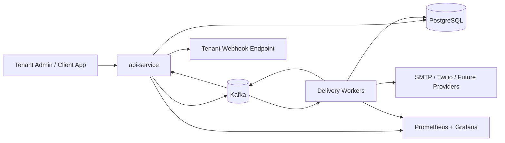
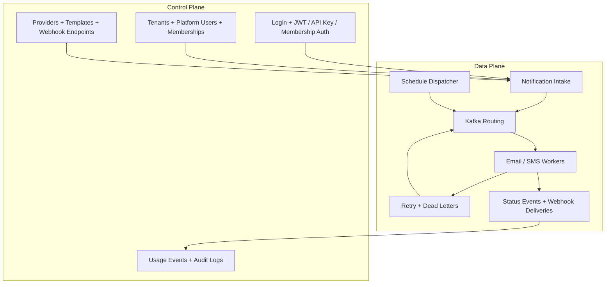
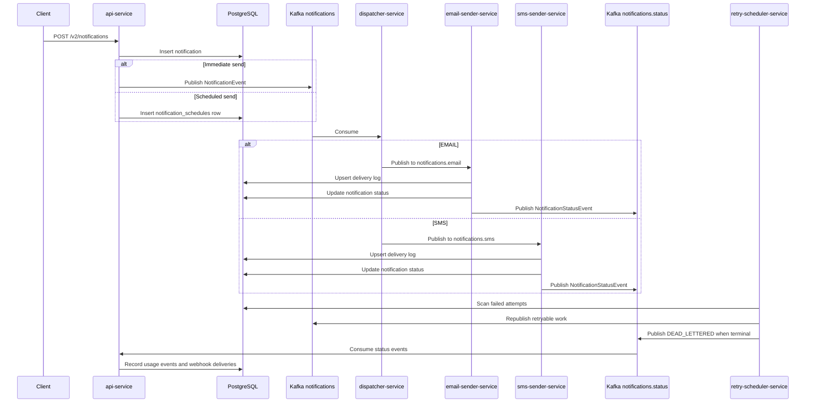

# NotiX High-Level Design

## 1. Overview

NotiX is a notification platform that separates notification intake from delivery execution. It began as a microservice POC for asynchronous email and SMS delivery and now includes a SaaS-oriented foundation with tenant-aware APIs, local JWT login, API keys, provider configuration, templates, scheduling, usage tracking, and webhook delivery.

The system is designed to answer two needs at the same time:

- preserve the original delivery-engine flow that proves the asynchronous architecture
- introduce the control-plane building blocks required for a future multi-tenant product

## 2. Design Goals

- accept notifications without blocking on downstream delivery
- route work by channel through Kafka
- keep notification intent separate from attempt-level execution history
- support retries and terminal DLQ handling
- introduce tenant-scoped APIs and identity without rewriting the whole platform
- allow API-first product evolution before investing in a full SaaS UI
- keep shared contracts centralized while keeping service persistence local

## 3. Scope Of The Current Architecture

### In Scope

- v1 notification send and status APIs
- v2 tenant bootstrap and tenant-scoped control-plane APIs
- local JWT login plus API key and external-header auth modes
- email and SMS delivery channels
- scheduled one-time sends
- usage metering and outbound status webhooks
- retry and dead-letter handling
- Prometheus and Grafana observability

### Deferred Or Partial

- PostgreSQL row-level security enforcement
- full external IdP token validation pipeline
- billing engine and hard quota enforcement
- provider failover and dynamic routing policy
- recurring campaigns and workflow orchestration

## 4. System Context

## 5. Logical Architecture

The current repo is easiest to understand as two planes sharing one platform core.

## 6. Main Components

| Component | Role |
| --- | --- |
| `api-service` | Public edge service, v1 API, v2 control plane, auth, schedule dispatch, status-event ingestion, webhook dispatch |
| `dispatcher-service` | Channel router from the main notifications topic to email and SMS topics |
| `email-sender-service` | Email worker that records attempts and emits status events |
| `sms-sender-service` | SMS worker that records attempts and emits status events |
| `retry-scheduler-service` | Recovery service that retries failed attempts and persists dead letters |
| `common` | Shared DTOs and enums that define inter-service contracts |

## 7. End-To-End Delivery Model

## 8. Architectural Decisions

### 8.1 Shared Contracts, Local Entities

`common` contains DTOs and enums only. JPA entities remain service-local even when they point to the same physical table names. This keeps schema access practical for the current repo without turning `common` into a persistence-coupled library.

### 8.2 One Shared PostgreSQL Instance For Now

The current implementation uses one logical PostgreSQL database for local development. This makes iteration easier while the platform is still stabilizing, but the schema is already partitioned conceptually by tenant and by business domain.

### 8.3 Canonical Notification Plus Attempt Logs

`notifications` is the business record. `delivery_logs` is the execution history. This separation is central to the v2 design because retries, metrics, status APIs, and future billing all depend on treating the notification itself as first-class.

### 8.4 Topic Sharing Over Per-Tenant Topic Explosion

Tenant context is carried in the payload and persisted on the data model. The platform does not create Kafka topics per tenant. This keeps broker topology manageable and pushes tenant isolation into application logic and, later, database policy.

## 9. Security Model

NotiX currently supports multiple auth styles because the platform is bridging POC and SaaS phases.

- v1 API key for the original POC endpoints
- bootstrap admin key for initial tenant creation
- tenant API keys for machine-to-machine v2 calls
- local JWT login for application users
- external-user-header mode for future external IdP integration

Authorization is tenant-aware through `tenant_memberships`, with `TENANT_ADMIN` and `TENANT_MEMBER` roles plus a platform-admin flag on `platform_users`.

## 10. Tenancy Model

The tenancy model is based on:

- `tenants`
- `platform_users`
- `tenant_memberships`
- `api_keys`

Every SaaS-oriented business record includes `tenant_id`. This is the basis for future row-level security, tenant filtering, usage reporting, and webhook scoping.

## 11. Reliability Model

Reliability today is achieved through:

- Kafka-based async handoff
- persistent notification records before publish
- attempt-level delivery logs
- retry scheduling
- dead-letter persistence
- idempotency key support on v2 notification creation
- webhook redelivery with capped retry attempts

## 12. Observability Model

The platform exposes actuator metrics and Prometheus endpoints. Grafana dashboards can be used to monitor JVM and delivery behavior, while the application data model provides operational visibility through:

- `delivery_logs`
- `dead_letters`
- `usage_events`
- `audit_logs`
- `webhook_deliveries`

## 13. Current Tradeoffs

- authentication is flexible, but external IdP token validation is not fully implemented yet
- tenant scoping exists in code and schema, but PostgreSQL RLS policies are still a future step
- email and SMS are the only active delivery channels
- the platform still carries v1 and v2 together, which adds complexity but preserves backward compatibility

## 14. Why This Design Works For NotiX

This architecture lets NotiX evolve without throwing away the core POC investment. The delivery engine remains simple and event-driven, while the API layer grows into a tenant-aware control plane. That is the right shape for a project moving from backend learning exercise toward a product-grade notification service.
