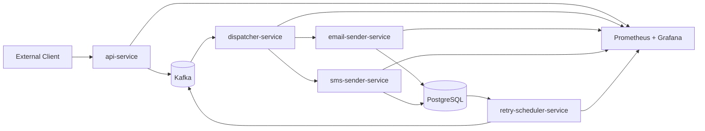
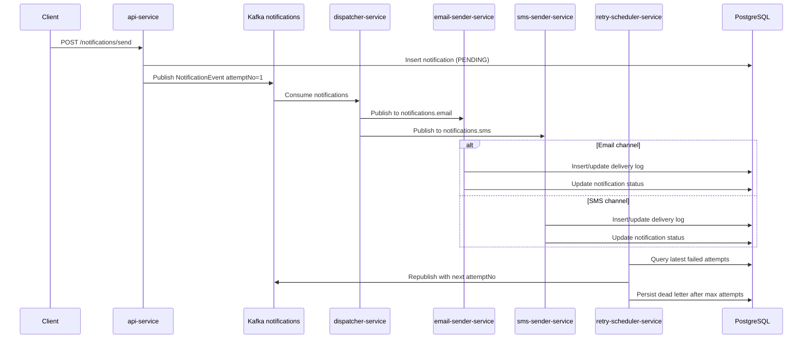

# NotiX High-Level Design

## 1. Purpose

NotiX is a microservice-based notification delivery platform POC. Its primary purpose is to demonstrate the architecture of an event-driven system that can:

- accept notification requests from external clients
- route work asynchronously
- support multiple delivery channels
- track delivery state
- retry failed notifications
- preserve terminal failures for inspection
- expose metrics and operational visibility

At this stage, NotiX is not positioning itself as a fully production-hardened SaaS product. It is a backend architecture exercise and a working platform foundation.

## 2. Goals

- decouple request intake from channel delivery
- support multiple delivery channels with room for future expansion
- maintain delivery attempt history
- reduce synchronous coupling through Kafka
- expose a clear operational model for failures and retries
- demonstrate security, documentation, and observability concerns

## 3. Non-Goals for This POC

- tenant isolation
- billing and quota enforcement
- workflow orchestration beyond basic channel routing
- provider failover and smart routing
- full-blown production CI/CD and infra automation
- multi-region resilience

## 4. System Context

External systems or clients call NotiX through the `api-service`. After that point, the platform uses Kafka topics and dedicated microservices to move the notification through routing, delivery, retry, and DLQ handling.

## 5. Architectural Style

NotiX follows an event-driven microservice architecture.

### Why this matters here

- `api-service` does not need to wait for delivery completion.
- channel workers stay independent from request intake logic.
- retry logic is separated from delivery logic.
- future channels can be added with limited impact on the upstream flow.

## 6. Major Components

### 6.1 `api-service`

Responsibilities:

- validate client requests
- enforce API key auth and rate limiting
- persist the notification record
- publish the initial `NotificationEvent`
- expose delivery status to clients

Primary entrypoints:

- `POST /notifications/send`
- `GET /notifications/status/{id}`

### 6.2 `dispatcher-service`

Responsibilities:

- consume from the main ingress topic
- inspect `channel`
- route to the correct channel topic

The dispatcher isolates routing rules from both the API and the channel workers.

### 6.3 `email-sender-service`

Responsibilities:

- consume from `notifications.email`
- perform email delivery logic
- store delivery attempts
- update notification status

In the current POC, the email send path is effectively mocked, but the delivery-state flow is implemented.

### 6.4 `sms-sender-service`

Responsibilities:

- consume from `notifications.sms`
- invoke Twilio
- store delivery attempts
- update notification status

### 6.5 `retry-scheduler-service`

Responsibilities:

- find the latest retryable failed attempts
- create the next pending attempt
- republish the notification with incremented `attemptNo`
- mark terminal failures
- store dead-letter entries

## 7. Core Data Flow

## 8. Data Ownership Model

Current POC shape:

- each service owns its own entity classes
- `common` owns shared DTOs and enums
- local development uses one PostgreSQL database instance

This is a deliberate compromise for the current POC:

- shared contracts are centralized
- service persistence code stays local
- the repo avoids tighter schema coupling from shared JPA entities

## 9. Shared Contracts

`common` contains:

- `SendRequest`
- `NotificationEvent`
- `StatusResponse`
- `Channel`
- `Status`

### Why `common` exists

It allows multiple services and even external local projects to depend on a single definition of:

- transport payloads
- channel enum values
- status enum values

## 10. Messaging Model

Topics:

- `notifications`
- `notifications.email`
- `notifications.sms`

Design intent:

- ingress topic for initial requests and retries
- dedicated downstream topics per channel
- simple fan-out and channel specialization

## 11. Persistence Model

### `notifications`

Tracks the canonical notification lifecycle.

Important fields:

- `id`
- `recipient`
- `channel`
- `template`
- `status`

### `delivery_logs`

Tracks each delivery attempt separately.

Important fields:

- `notification_id`
- `attempt_no`
- `status`
- `error_message`
- `timestamp`

### `dead_letters`

Stores terminal failures for later inspection and operations.

Important fields:

- `id`
- `recipient`
- `channel`
- `template`
- `status`
- `error_message`
- `created_at`

## 12. Reliability Model

Reliability is handled through:

- durable notification persistence before publish
- Kafka decoupling between producer and workers
- delivery attempt tracking
- retry scheduling
- dead-letter persistence for terminal failure visibility

Current retry policy:

- max attempts: `3`
- scheduled retry scan: every `15` seconds
- scheduled DLQ sweep: every `60` seconds

## 13. Security Model

Implemented today in `api-service`:

- API key auth using `X-API-KEY`
- in-memory Bucket4j rate limiting

This is appropriate for a POC but should evolve for production.

## 14. Observability Model

Each service exposes:

- health endpoints
- info endpoints
- metrics
- Prometheus scraping support

Operational stack:

- Prometheus
- Grafana
- Spring Boot Actuator

The repo already includes a Grafana dashboard JSON for quick local setup.

## 15. Deployment Shape

Current local deployment uses:

- one Kafka broker
- one Zookeeper instance
- one PostgreSQL instance
- one Prometheus container
- one Grafana container
- five Spring Boot services started independently

This is sufficient for local demos and development.

## 16. Why This Architecture Is Valuable

This project demonstrates more than CRUD microservices. It shows how a real asynchronous platform can be composed from small services with clear operational responsibilities:

- request intake
- routing
- delivery
- retry
- failure retention
- visibility

That is the core architectural achievement of NotiX today.

## 17. Future Evolution Path

The earlier future-state architecture ideas in this repo point toward:

- tenant-aware routing
- auth service
- billing and usage metering
- dashboard service
- stronger ingress and gateway patterns

Those ideas remain valuable, but the current codebase intentionally focuses on the simpler POC foundation first.
