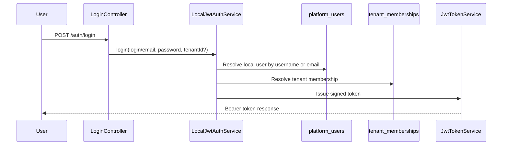
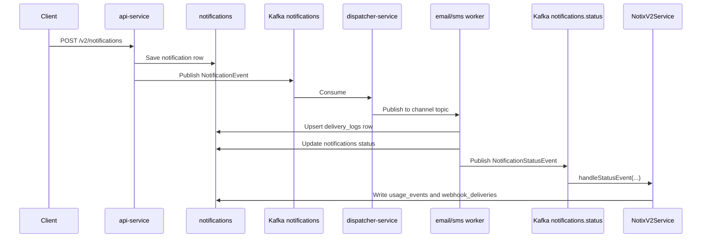
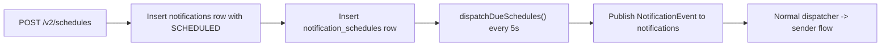
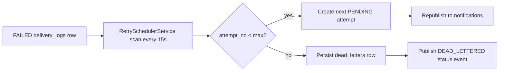

# NotiX Low-Level Design

## 1. Purpose

This document maps the current codebase to the runtime design of NotiX. It focuses on the concrete services, controllers, listeners, scheduled jobs, message contracts, and persistence structures that make the system work today.

## 2. Module Breakdown

| Module | Main Responsibilities | Important Classes |
| --- | --- | --- |
| `common` | Shared DTOs and enums | `SendRequest`, `NotificationEvent`, `NotificationStatusEvent`, `Channel`, `Status` |
| `api-service` | v1 and v2 APIs, login, auth filters, notification orchestration, schedule dispatch, status ingestion, usage metering, webhook dispatch | `NotificationController`, `LoginController`, `NotixV2Controller`, `NotificationService`, `LocalJwtAuthService`, `NotixV2Service`, `NotificationStatusListener`, `ApiKeyAuthFilter`, `V2AuthFilter` |
| `dispatcher-service` | Kafka routing by channel | `NotificationRouter` |
| `email-sender-service` | Email consumption, attempt logging, status publishing | `EmailNotificationListener`, `EmailSenderService` |
| `sms-sender-service` | SMS consumption, provider use, attempt logging, status publishing | `SmsNotificationListener`, `SmsSenderService` |
| `retry-scheduler-service` | Retry scans, DLQ persistence, terminal status publishing | `RetrySchedulerService`, `RetryController`, `DeadLetterController` |

## 3. HTTP Endpoints

### api-service

| Endpoint | Purpose |
| --- | --- |
| `POST /notifications/send` | v1 notification intake |
| `GET /notifications/status/{id}` | v1 status lookup |
| `POST /auth/login` | Local app login returning JWT |
| `POST /v2/auth/login` | Same login flow under v2 namespace |
| `POST /v2/tenants` | Bootstrap a tenant with an initial owner |
| `POST /v2/tenant-memberships` | Add tenant users and roles |
| `POST /v2/api-keys` | Create tenant API keys |
| `POST /v2/providers` | Register tenant provider accounts |
| `POST /v2/templates` | Register tenant templates |
| `POST /v2/webhooks` | Register tenant webhook endpoints |
| `POST /v2/notifications` | Create and dispatch an immediate notification |
| `GET /v2/notifications/{id}` | Get a tenant-scoped notification |
| `GET /v2/notifications/{id}/attempts` | Get tenant-scoped attempts |
| `POST /v2/schedules` | Create a future scheduled notification |
| `GET /v2/usage` | Aggregate usage events for a tenant |

### dispatcher-service

| Endpoint | Purpose |
| --- | --- |
| `POST /notifications/send` | Manual routing test endpoint |

### email-sender-service

| Endpoint | Purpose |
| --- | --- |
| `POST /test/email/send` | Manual email worker test endpoint |

### sms-sender-service

| Endpoint | Purpose |
| --- | --- |
| `POST /test/sms/send` | Manual SMS worker test endpoint |

### retry-scheduler-service

| Endpoint | Purpose |
| --- | --- |
| `POST /retry/trigger` | Force retry scan |
| `GET /retry/dead-letters` | Read DLQ rows |
| `GET /dlq` | List dead letters |
| `GET /dlq/channel/{channel}` | Filter DLQ by channel |
| `GET /dlq/template/{template}` | Filter DLQ by template |
| `GET /dlq/search` | Search DLQ |
| `POST /test/retry/trigger` | Manual retry test endpoint |

## 4. Authentication And Authorization

The repo currently supports four auth modes:

- v1 API key via `ApiKeyAuthFilter`
- v2 bootstrap admin key on `POST /v2/tenants`
- v2 tenant API key and external-user-header auth in `V2AuthFilter`
- local bearer JWT via `LoginController` and `LocalJwtAuthService`

`AuthenticatedActor` is the request identity object used inside v2 services. It carries `tenantId`, `platformUserId`, `apiKeyId`, `membershipRole`, and `platformAdmin`.

## 5. Notification Runtime Flow

### 5.1 Immediate Notification

### 5.2 Scheduled Notification

### 5.3 Retry And Dead-Letter Flow

## 6. Kafka Contracts

| Contract | Producer(s) | Consumer(s) | Key Fields |
| --- | --- | --- | --- |
| `NotificationEvent` | `api-service`, `retry-scheduler-service` | `dispatcher-service`, then workers | `id`, `tenantId`, `to`, `channel`, `template`, `templateId`, `params`, `idempotencyKey`, `providerAccountId`, `subject`, `body`, `scheduledAt`, `attemptNo` |
| `NotificationStatusEvent` | `email-sender-service`, `sms-sender-service`, `retry-scheduler-service` | `api-service` | `tenantId`, `notificationId`, `channel`, `status`, `eventType`, `attemptNo`, `errorMessage`, `occurredAt` |

## 7. Service Internals

### common

- `SendRequest`
  - public v1 input DTO
- `NotificationEvent`
  - internal async contract used across services
- `NotificationStatusEvent`
  - status fan-in contract used by the API service

### api-service

#### v1 path

- `NotificationController`
  - handles send and status endpoints
- `NotificationService`
  - creates a notification row and publishes the first event

#### v2 path

- `LoginController`
  - local login endpoint for bearer JWT issuance
- `LocalJwtAuthService`
  - validates local users and resolves memberships
- `NotixV2Controller`
  - exposes tenant, provider, template, webhook, notification, schedule, and usage endpoints
- `NotixV2Service`
  - central orchestration layer for the v2 control plane and runtime support
- `NotificationStatusListener`
  - consumes `notifications.status`

#### v2 background jobs

- `dispatchDueSchedules()`
  - every `5s`
- `dispatchWebhookDeliveries()`
  - every `10s`

#### v2 startup seeding

- `DefaultIdentitySeeder`
  - ensures a default tenant
  - seeds `admin` and `operator` local users

### dispatcher-service

- `NotificationRouter`
  - single responsibility router from `notifications` to `notifications.email` or `notifications.sms`

### email-sender-service

- `EmailNotificationListener`
  - Kafka consumer for the email topic
- `EmailSenderService`
  - resolves the provider account
  - persists/upserts the attempt log
  - updates the notification row
  - emits `NotificationStatusEvent`

### sms-sender-service

- `SmsNotificationListener`
  - Kafka consumer for the SMS topic
- `SmsSenderService`
  - same runtime shape as the email worker with Twilio/provider specifics

### retry-scheduler-service

- `RetrySchedulerService`
  - scans retryable failures every `15s`
  - scans DLQ handling every `60s`
  - republishes retry work
  - writes dead letters
  - emits terminal `NotificationStatusEvent`

## 8. Persistence Responsibilities

| Table | Main Owner In Code | Purpose |
| --- | --- | --- |
| `notifications` | `api-service` plus sender/retry readers | Canonical notification intent and current lifecycle state |
| `delivery_logs` | sender services and retry service | Attempt history |
| `dead_letters` | `retry-scheduler-service` | Terminal failure store |
| `tenants` | `api-service` | Tenant master record |
| `platform_users` | `api-service` | Local or external user identities |
| `tenant_memberships` | `api-service` | Tenant-role mapping |
| `api_keys` | `api-service` | Machine access for tenant APIs |
| `provider_accounts` | `api-service`, sender readers | Tenant-owned provider config |
| `notification_templates` | `api-service` | Tenant templates |
| `notification_schedules` | `api-service` | One-time future dispatch |
| `usage_events` | `api-service` | Immutable product metering |
| `webhook_endpoints` | `api-service` | Tenant webhook configuration |
| `webhook_deliveries` | `api-service` | Outbound webhook retry state |
| `audit_logs` | `api-service` | Control-plane audit trail |

The full table details and relationship model are captured in [Database Design](Database-Design.md).

## 9. Scheduler And Retry Cadence

| Job | Service | Interval |
| --- | --- | --- |
| Schedule dispatch | `api-service` | `5 seconds` |
| Webhook dispatch | `api-service` | `10 seconds` |
| Delivery retry scan | `retry-scheduler-service` | `15 seconds` |
| DLQ sweep | `retry-scheduler-service` | `60 seconds` |

## 10. Configuration Defaults

| Setting | Default |
| --- | --- |
| Kafka | `localhost:9092` |
| PostgreSQL | `localhost:5433/notix` |
| v1 API key | `notix-secret-key` |
| v2 bootstrap key | `notix-bootstrap-admin-key` |
| JWT expiry | `120 minutes` |
| Default tenant domain | `default.notix.local` |
| Default admin login | `admin / admin123` |
| Default operator login | `operator / operator123` |

## 11. Important Implementation Notes

- v1 and v2 coexist in the same `api-service`
- tenant filtering is enforced in service logic and repositories
- the sender services and retry service use local entity copies, not shared JPA entities
- `common` intentionally stays at DTO/enum level
- `delivery_logs` is append/update by attempt, while `notifications` remains the canonical business record
- `dead_letters` currently stores a terminal failure snapshot and does not keep a direct foreign key back to `notifications`

## 12. What To Read First In Code

If you are onboarding to the repo, start in this order:

1. `common` DTOs and enums
2. `api-service` controllers and `NotixV2Service`
3. `dispatcher-service` router
4. sender services
5. `retry-scheduler-service`
6. [Database Design](Database-Design.md)
